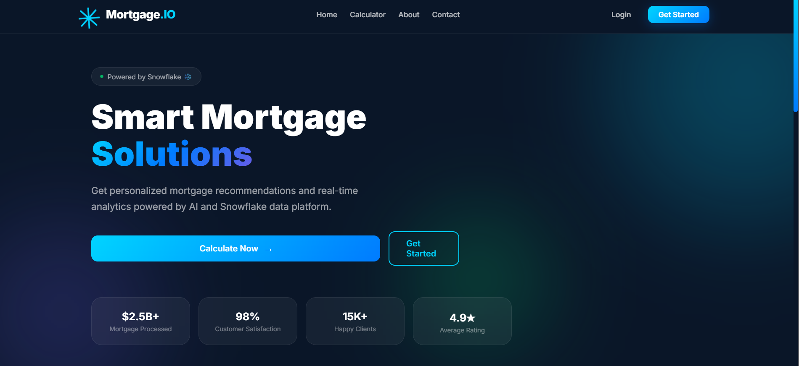
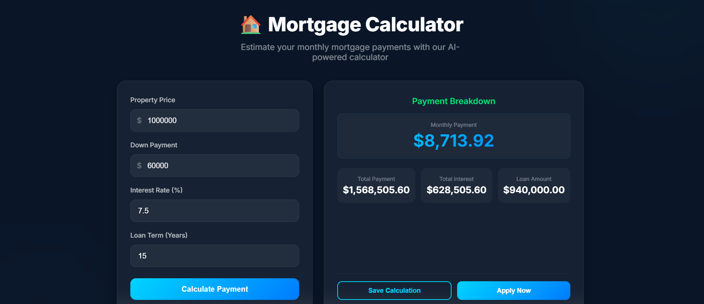
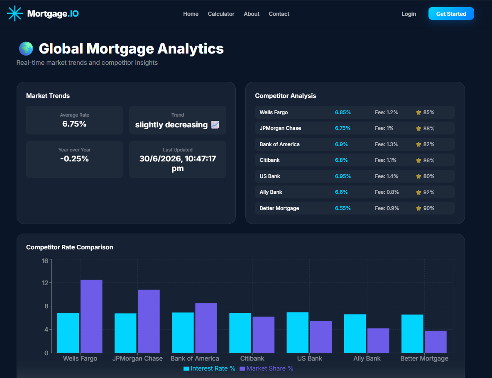

# ?? Mortgage-io - Full-Stack Data Realtime Mortgage Application with AI Integration and DataPiple
 
 
 
 
 
 
 
 
 
 
--- 
 
##  Application Screenshots 
 
### 1) Home Page 
 
 
### 2) Mortgage Calculator 
 
 
 
### 3) Dashboard 
 
 
--- 
 
##  Overview 
 
**Mortgage-io** is a full-stack mortgage application that leverages **Artificial Intelligence** to provide intelligent mortgage predictions, real-time calculations, and personalized financial advice. 
 
--- 
 
##  Technology Stack 
 
### Backend 
- Spring Boot 2.7.18 
- Java 21 
- Spring Security with JWT 
- Spring Data JPA / Hibernate 
- MySQL 8.0 
- LangChain4j (AI Framework) 
- OpenAI Integration 
- Apache OpenNLP 
- Cloudinary (Image Recognition) 
- Snowflake (Data Warehouse) 
- Power BI Integration 
 
### Frontend 
- React 18.2.0 
- React Router DOM 
- Axios 
- Recharts (Data Visualization) 
- CSS Modules 
 
--- 
 
 
--- 
 
##  Features 
 
### User Features 
- ?? Browse Mortgage Offers 
- ?? Mortgage Calculator 
- ?? AI Chatbot for queries 
- ?? AI Mortgage Prediction 
- ?? Save Favorite Offers 
- ?? Application Tracking 
 
### Business Owner Features 
- ?? Create Mortgage Offers 
- ?? Analytics Dashboard (Power BI) 
- ?? Track Applications in real-time 
- ?? Manage Client Requests 
- ?? Bulk Data Upload 
 
### Admin Features 
- ?? Global Analytics Dashboard 
- ?? Bulk Data Upload 
- ?? User Management 
- ?? Application Review 
 
--- 
 
 
### Prerequisites 
- Java 17+ 
- Node.js 16+ 
- MySQL 8.0+ 
 
### Step 1: Clone the Repository 
```bash 
git clone https://github.com/SRIKANTHBHAGYANAGARAJ/mortgage-io.git 
cd mortgage-io 
``` 
 
### Step 2: Backend Setup 
```bash 
cd BackEnd 
./mvnw clean install 
``` 
 
**Configure MySQL in** `BackEnd/src/main/resources/application.properties`: 
```properties 
spring.datasource.url=jdbc:mysql://localhost:3306/mortgage_db 
spring.datasource.username=root 
spring.datasource.password=your_password 
spring.jpa.hibernate.ddl-auto=update 
jwt.secret=your-super-secret-key-for-jwt-1234567890 
jwt.expiration=86400000 
server.port=8081 
openai.api.key=your-openai-api-key 
``` 
 
### Step 3: Frontend Setup 
```bash 
cd ../FrontEnd 
npm install 
``` 
 
**Create `.env` file in FrontEnd/** 
```env 
REACT_APP_API_URL=http://localhost:8081 
REACT_APP_CHATBOT_ENABLED=true 
REACT_APP_AI_ENABLED=true 
REACT_APP_ANALYTICS_ENABLED=true 
``` 
 
--- 
 
## ?? Running the Application 
 
### Start Backend (Terminal 1) 
```bash 
cd BackEnd 
./mvnw spring-boot:run 
``` 
 
**Backend:** http://localhost:8081 
 
### Start Frontend (Terminal 2) 
```bash 
cd FrontEnd 
npm start 
``` 
 
**Frontend:** http://localhost:3000 
 
### API Documentation 
**Swagger UI:** http://localhost:8081/swagger-ui/index.html 
 
--- 
 
##  API Endpoints 
 
 
--- 
 
##  Deployment 
 
### Docker Deployment 
```bash 
docker-compose up -d 
``` 
 
### Traditional Deployment 
```bash 
# Backend 
 
# Frontend 
``` 
 
--- 
 
##  Contributing 
 
1. Fork the repository 
2. Create a feature branch: `git checkout -b feature/YourFeature` 
3. Commit your changes: `git commit -m "Add your feature"` 
4. Push: `git push origin feature/YourFeature` 
5. Open a Pull Request 
 
--- 
 
##  License 
 
This project is licensed under the MIT License. 
 
--- 
 
##  Contact 
 
- **GitHub**: [SRIKANTHBHAGYANAGARAJ](https://github.com/SRIKANTHBHAGYANAGARAJ) 
- **Repository**: [mortgage-io](https://github.com/SRIKANTHBHAGYANAGARAJ/mortgage-io) 
- **Issues**: [Report Issues](https://github.com/SRIKANTHBHAGYANAGARAJ/mortgage-io/issues) 
 
--- 
 
##  Acknowledgments 
 
- **Spring Boot** for the robust backend framework 
- **React** for the responsive UI 
- **LangChain4j** for AI integration 
- **OpenAI** for AI capabilities 
- **Power BI** for analytics 
- **Snowflake** for data warehousing 
- **Cloudinary** for image management 
 
--- 
 
##  Show Your Support 
 
If you find this project useful, please give it a ? on GitHub! 
 
--- 
 
**Built with ?? using Spring Boot, React, and AI** 
 *Email-id:srikanthbhagayanagaraj@gmail.com 
*Last Updated: July 2026* 
